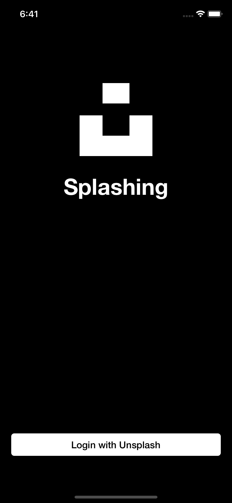
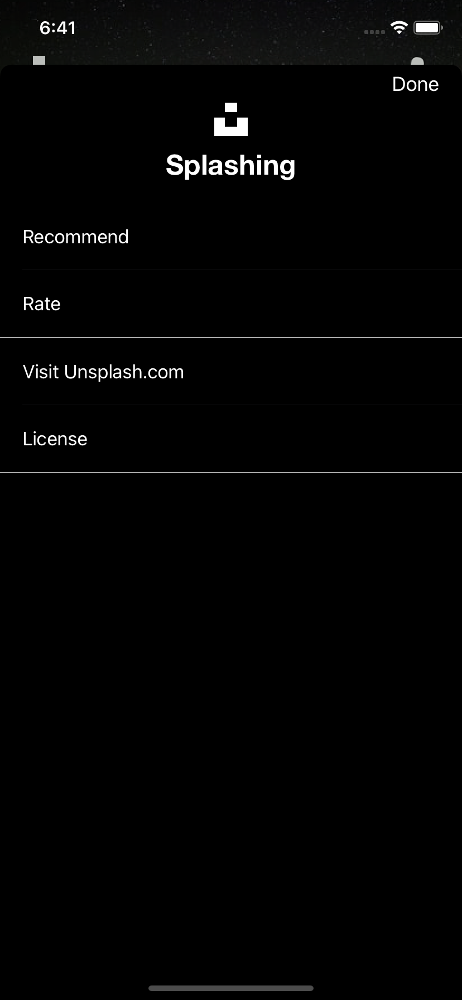

# Splashing
 
 Unsplash application clone

 

 인원 : 1명
 기간 : 2020.08.30 - 2020.09.27

 설명 : [Unsplash](https://apps.apple.com/us/app/unsplash/id1290631746) 애플리케이션을 clone 하여 만들었습니다. [전수열](http://github.com/devxoul) 님의 [Drrrible](https://github.com/devxoul/Drrrible) 예제 어플리케이션을 참고했습니다.

 ## Screenshots

   

  

 ## Library

 - [CocoaLumberjack](https://github.com/CocoaLumberjack/CocoaLumberjack)
 - [KeychainAccess](https://github.com/kishikawakatsumi/KeychainAccess)
 - [RxSwift](https://github.com/kishikawakatsumi/KeychainAccess)
 - [RxKingfisher](https://github.com/RxSwiftCommunity/RxKingfisher)
 - [RxOptional](https://github.com/RxSwiftCommunity/RxOptional)
 - [SnapKit](https://github.com/SnapKit/SnapKit)
 - [Swinject](https://github.com/Swinject/Swinject)
 - [SwiftyImage](https://github.com/devxoul/SwiftyImage)
 - [Then](https://github.com/devxoul/Then)
 - [Toaster](https://github.com/devxoul/Toaster)

 ## Feature

 - Dependency injection with [Swinject](https://github.com/Swinject/Swinject)
 - OAuth 2.0
 - RxSwift + MVVM-C
 - Using Codable
 - Without Storyboard

 ## Requirement

 - iOS 13
    - Using `SFSymbol`

 - Swift 5

